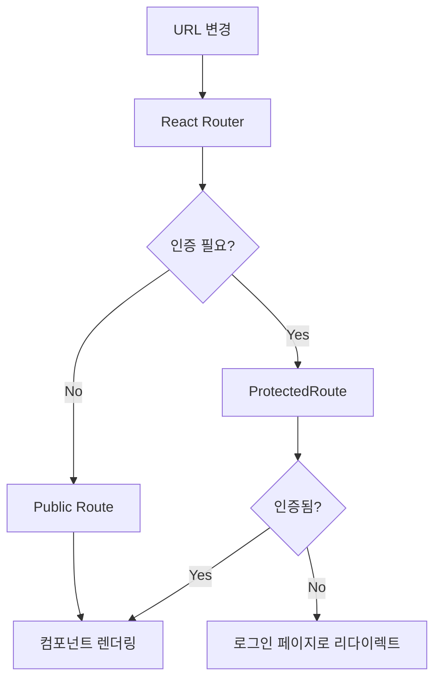

# P02 - 시스템 아키텍처 (System Architecture)

## 🏗 전체 아키텍처 개요

본 프로젝트는 **React 기반의 SPA(Single Page Application)** 아키텍처를 채택하여 모던하고 확장 가능한 프론트엔드 시스템을 구축했습니다.

## 📐 아키텍처 패턴

### 1. 컴포넌트 기반 아키텍처 (Component-Based Architecture)
```
┌─────────────────────────────────────┐
│              Pages                  │
├─────────────────────────────────────┤
│            Layout                   │
├─────────────────────────────────────┤
│         Business Logic              │
│    (Contexts, Hooks, Services)      │
├─────────────────────────────────────┤
│        UI Components                │
│    (Common, Layout, Primitives)     │
├─────────────────────────────────────┤
│           Utilities                 │
│      (Utils, Constants, Lib)        │
└─────────────────────────────────────┘
```

### 2. 상태 관리 아키텍처
- **React Context API**: 전역 상태 관리
- **useState/useEffect**: 로컬 상태 관리
- **Custom Hooks**: 로직 재사용 및 관심사 분리

## 🗂 디렉토리 구조 및 역할

### `/src/components/`
컴포넌트는 3계층으로 구성됩니다:

#### `ui/` - UI 프리미티브 계층
- **목적**: 재사용 가능한 기본 UI 컴포넌트
- **특징**: Radix UI 기반, 접근성 최우선
- **예시**: Button, Card, Dialog, Avatar
```typescript
// 설계 원칙
- 단일 책임 원칙
- 완전한 접근성 (ARIA 지원)
- 일관된 디자인 시스템
- Props 기반 커스터마이징
```

#### `common/` - 공통 비즈니스 컴포넌트
- **목적**: 비즈니스 로직을 포함한 재사용 컴포넌트
- **특징**: 도메인 특화 로직 포함
- **예시**: ProtectedRoute, LoadingSpinner

#### `layout/` - 레이아웃 컴포넌트
- **목적**: 페이지 구조 및 네비게이션
- **특징**: 전체적인 UI 구조 담당
- **예시**: Header, Layout, Sidebar

### `/src/contexts/`
전역 상태 관리를 위한 React Context들:

#### `AuthContext.jsx`
```javascript
// 인증 상태 관리
- 사용자 로그인/로그아웃
- 토큰 관리 (localStorage)
- 인증 상태 추적
- 보호된 라우트 지원
```

#### `ThemeContext.jsx` (추정)
```javascript
// 테마 상태 관리
- 다크/라이트 모드
- 사용자 선호도 저장
- 실시간 테마 전환
```

### `/src/pages/`
페이지 레벨 컴포넌트:
- **LandingPage**: 비인증 사용자 대상 랜딩
- **LoginPage/RegisterPage**: 인증 관련 페이지
- **ChatPage**: 메인 채팅 인터페이스
- **TemplatesPage**: 템플릿 관리
- **DashboardPage**: 사용자 대시보드

### `/src/services/`
외부 API 통신 및 비즈니스 로직:
```javascript
// 설계 원칙
- Axios 기반 HTTP 클라이언트
- API 엔드포인트 추상화
- 에러 처리 중앙화
- 요청/응답 인터셉터
```

### `/src/hooks/`
커스텀 React Hooks:
```javascript
// 목적
- 로직 재사용
- 상태 로직 분리
- 컴포넌트 간 로직 공유
- 테스트 용이성
```

### `/src/utils/`
순수 함수 및 유틸리티:
```javascript
// 설계 원칙
- 사이드 이펙트 없음
- 테스트 가능한 순수 함수
- 타입 안정성
- 재사용성
```

## 🔄 데이터 플로우

### 1. 인증 플로우
```mermaid
graph TD
    A[사용자 액션] --> B[LoginPage]
    B --> C[AuthContext.login()]
    C --> D[API 호출]
    D --> E[토큰 저장]
    E --> F[사용자 상태 업데이트]
    F --> G[보호된 라우트 접근]
```

### 2. 라우팅 플로우


### 3. 컴포넌트 통신
```javascript
// 상향식 데이터 플로우 (Bottom-up)
UI Component → Event Handler → Context/Parent → State Update

// 하향식 데이터 플로우 (Top-down)
Context/Parent → Props → Child Component → UI Render
```

## 🛡 보안 아키텍처

### 1. 인증 보안
- **토큰 기반 인증**: JWT 토큰 (localStorage 저장)
- **보호된 라우트**: ProtectedRoute 컴포넌트로 접근 제어
- **자동 로그아웃**: 토큰 만료 시 자동 처리

### 2. 클라이언트 사이드 보안
```javascript
// 보안 원칙
- XSS 방지: React의 기본 이스케이핑
- CSRF 방지: 토큰 기반 인증
- 민감 정보 보호: 환경 변수 사용
- 입력 검증: 클라이언트 사이드 밸리데이션
```

## 🎨 UI/UX 아키텍처

### 1. 디자인 시스템
```css
/* 계층별 스타일링 */
Global Styles (index.css)
    ↓
TailwindCSS Utilities
    ↓
Component Specific Styles
    ↓
Radix UI Primitives
```

### 2. 테마 시스템
- **CSS 변수 기반**: 동적 테마 변경
- **TailwindCSS 통합**: 유틸리티 클래스와 연동
- **접근성 고려**: 색상 대비 및 사용성

### 3. 반응형 디자인
```javascript
// 브레이크포인트 전략
- Mobile First: 모바일 우선 설계
- Progressive Enhancement: 점진적 향상
- Flexible Grid: CSS Grid/Flexbox 활용
```

## 🔧 빌드 및 번들 아키텍처

### 1. Vite 빌드 시스템
```javascript
// 최적화 전략
- ESModule 기반 빠른 개발 서버
- Tree Shaking: 사용하지 않는 코드 제거
- Code Splitting: 동적 import로 청크 분할
- Asset Optimization: 이미지/폰트 최적화
```

### 2. 의존성 관리
```javascript
// 번들 최적화
- Production Dependencies: 런타임 필수 라이브러리
- Development Dependencies: 개발 도구
- Peer Dependencies: 호환성 관리
```

## 📊 성능 아키텍처

### 1. 렌더링 최적화
```javascript
// React 최적화 기법
- React.memo(): 불필요한 리렌더링 방지
- useMemo/useCallback: 값/함수 메모이제이션
- 컴포넌트 분할: 작은 단위로 책임 분리
```

### 2. 번들 최적화
```javascript
// 코드 분할 전략
- Route-based Splitting: 페이지별 분할
- Component-based Splitting: 컴포넌트별 분할
- Vendor Splitting: 서드파티 라이브러리 분리
```

## 🧪 테스트 아키텍처

### 1. 테스트 전략 (계획)
```javascript
// 테스트 피라미드
Unit Tests (Utils, Hooks)
    ↓
Integration Tests (Components)
    ↓
E2E Tests (User Flows)
```

### 2. 테스트 도구 (권장)
- **Jest**: 단위 테스트
- **React Testing Library**: 컴포넌트 테스트
- **Cypress/Playwright**: E2E 테스트

## 🚀 확장성 고려사항

### 1. 모듈화
- **명확한 책임 분리**: 단일 책임 원칙
- **의존성 주입**: Context를 통한 의존성 관리
- **인터페이스 기반**: Props 타입 정의로 계약 명시

### 2. 미래 확장 포인트
```javascript
// 확장 가능 영역
- 상태 관리: Redux Toolkit 도입 고려
- API 계층: React Query/SWR 도입
- 타입 시스템: TypeScript 완전 도입
- 마이크로 프론트엔드: Module Federation 고려
```

---

*문서 작성일: 2025년 9월 21일*
*작성자: Claude Code Assistant*